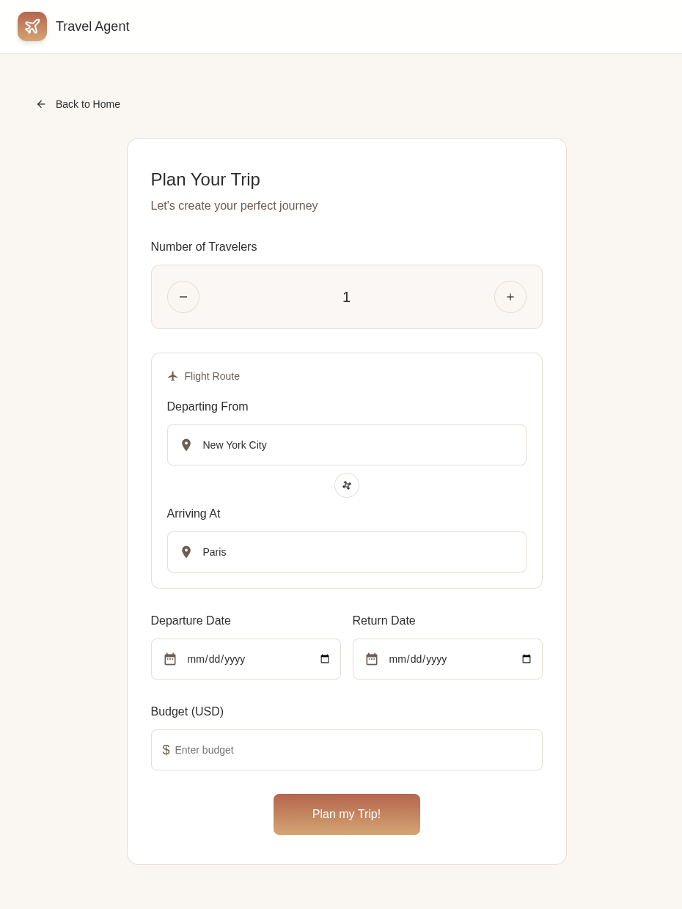
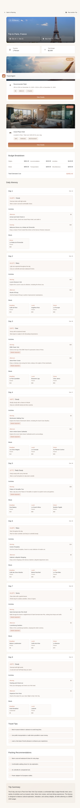

# Travel Agent

An intelligent travel planning application built with React 19 and Vite that helps users plan their perfect trip by combining real-time flight data, hotel information, and weather forecasts with AI-powered recommendations.

## Features

- **Smart Trip Planning**: Interactive form with location swap, traveler counter, and budget planning
- **Real-time Data**: Fetches live flight, hotel, and weather information from multiple APIs
- **AI-Powered Recommendations**: Uses OpenAI to generate personalized trip plans
- **Concurrent API Calls**: Parallel data fetching using Promise.all for optimal performance
- **Advanced Caching**: IndexedDB-based caching system for airport codes and city coordinates
- **Code Splitting**: Lazy-loaded routes with React.lazy for faster initial load
- **Session Storage**: Efficient data handling for large trip plans
- **Mobile-First Design**: Responsive CSS with mobile-first approach
- **Modern React**: Built with React 19 featuring hooks like useActionState

## Screenshots

### Home Page

*Landing page featuring the hero section with trip planning call-to-action and key features*

### Planning Page

*Interactive trip planning form with location inputs, date pickers, traveler counter, and budget input*

### Results Page

*Comprehensive trip itinerary with flight options, hotel recommendations, daily schedule, weather forecasts, and AI-generated travel tips*

## Tech Stack

- **React 19** - Latest React with Fast Refresh
- **Vite 7** - Lightning-fast build tool with HMR
- **React Router 7** - Client-side routing with lazy loading
- **OpenAI** - AI-powered trip plan generation
- **IndexedDB** - Client-side data persistence via idb library
- **Zod** - Schema validation for API responses
- **ESLint** - Code quality and consistency

## Project Structure

```
travel-agent/
├── src/
│   ├── apis/                  # API integration modules
│   │   ├── flightApi.js      # Amadeus flight search API
│   │   ├── hotelApi.js       # Amadeus hotel search API
│   │   ├── tripPlanApi.js    # OpenAI trip planning integration
│   │   └── weatherApi.js     # OpenWeather API integration
│   ├── components/            # Reusable components
│   │   ├── Header.jsx        # Navigation header
│   │   └── Header.css
│   ├── pages/                 # Route components (lazy loaded)
│   │   ├── Home.jsx          # Landing page
│   │   ├── Home.css
│   │   ├── Planning.jsx      # Trip planning form
│   │   ├── Planning.css
│   │   ├── Results.jsx       # Trip plan results
│   │   └── Results.css
│   ├── utils/                 # Utility functions and helpers
│   │   ├── cache/            # IndexedDB caching system
│   │   │   ├── cacheDB.js   # Database schema and initialization
│   │   │   ├── indexedDBCache.js  # Generic cache operations
│   │   │   ├── airportCache.js    # Airport code caching
│   │   │   └── coordinatesCache.js # City coordinates caching
│   │   ├── formatters.js     # Data formatting utilities
│   │   ├── logger.js         # Logging utilities
│   │   └── tokenCache.js     # Amadeus token management
│   ├── api.js                 # Main API orchestration
│   ├── config.js              # API keys and configuration
│   ├── App.jsx                # Root component with routing
│   └── main.jsx               # Application entry point
├── public/                    # Static assets
│   ├── favicon files          # Various icon sizes
│   └── site.webmanifest      # PWA manifest
├── eslint.config.js          # ESLint configuration
├── vite.config.js            # Vite build configuration
├── package.json              # Dependencies and scripts
└── CLAUDE.md                 # Claude Code AI assistant instructions
```

## Getting Started

### Prerequisites

- Node.js (v16 or higher)
- npm or yarn
- API keys for:
  - Amadeus (flights and hotels)
  - OpenAI (trip planning)
  - OpenWeather (weather data)

### Installation

1. Clone the repository:
```bash
git clone <repository-url>
cd travel-agent
```

2. Install dependencies:
```bash
npm install
```

3. Create a `.env` file in the root directory with your API keys:
```env
VITE_AMADEUS_API_KEY=your_amadeus_api_key
VITE_AMADEUS_API_SECRET=your_amadeus_api_secret
VITE_OPENAI_API_KEY=your_openai_api_key
VITE_OPENWEATHER_API_KEY=your_openweather_api_key
```

4. Start the development server:
```bash
npm run dev
```

5. Open your browser to `http://localhost:5173`

## Development Commands

- `npm run dev` - Start Vite development server with HMR
- `npm run build` - Build for production
- `npm run lint` - Run ESLint on all files
- `npm run preview` - Preview production build locally

## Key Features Explained

### Concurrent API Calls

The application uses `Promise.all` to fetch weather, flight, and hotel data simultaneously, significantly reducing total loading time:

```javascript
const [weatherData, flightData, hotelData] = await Promise.all([
  fetchWeatherData(tripData),
  fetchFlightData(tripData),
  fetchHotelData(tripData)
]);
```

### IndexedDB Caching

A sophisticated caching system reduces API calls and improves performance:

- **Airport Codes Cache**: Stores city-to-airport code mappings in `src/utils/cache/airportCache.js:20`
- **Coordinates Cache**: Caches city latitude/longitude data in `src/utils/cache/coordinatesCache.js:15`
- **Token Cache**: Manages Amadeus OAuth tokens in memory in `src/utils/tokenCache.js:10`
- **Centralized Schema**: Database versioning and structure managed in `src/utils/cache/cacheDB.js:32`

### Code Splitting

Routes are lazy-loaded to minimize initial bundle size in `src/App.jsx:7`:

```javascript
const Planning = lazy(() => import('./pages/Planning'));
const Results = lazy(() => import('./pages/Results'));
```

### Session Storage Optimization

Large trip plans are stored in sessionStorage instead of navigation state to improve performance and avoid memory issues. See `src/pages/Planning.jsx:142`.

## API Integration

### Amadeus API
- **Flights**: Real-time flight search with price and availability (`src/apis/flightApi.js`)
- **Hotels**: Hotel search by location with pricing (`src/apis/hotelApi.js`)
- **Authentication**: OAuth 2.0 token management with automatic refresh

### OpenAI API
- Generates personalized trip plans based on user preferences and fetched data (`src/apis/tripPlanApi.js`)
- Provides recommendations for activities, dining, and local experiences

### OpenWeather API
- Fetches weather forecasts for destination cities (`src/apis/weatherApi.js`)
- Provides temperature, conditions, and precipitation data

## Configuration

API configuration is centralized in `src/config.js`. For local development, use a `.env` file with the following variables:

```env
VITE_AMADEUS_API_KEY=
VITE_AMADEUS_API_SECRET=
VITE_OPENAI_API_KEY=
VITE_OPENWEATHER_API_KEY=
```

## Build Optimization

The project uses several optimization techniques:

- **Vite 7**: Modern build tool with native ES modules
- **Terser**: JavaScript minification for smaller bundle sizes
- **Image Optimization**: vite-imagetools for responsive images
- **Compression**: vite-plugin-compression for gzip/brotli compression
- **Tree Shaking**: Automatic removal of unused code
- **Code Splitting**: Automatic chunking for optimal loading
- **Lazy Loading**: React.lazy() for route-based code splitting

## Utilities

### Formatters (`src/utils/formatters.js`)
- Date formatting
- Currency formatting
- Number formatting for display

### Logger (`src/utils/logger.js`)
- Centralized logging for development
- IndexedDB operation logging
- Cache hit/miss tracking

### Cache System (`src/utils/cache/`)
- **cacheDB.js**: Database schema, versioning, and initialization
- **indexedDBCache.js**: Generic get/set operations for any store
- **airportCache.js**: City name to airport code mapping
- **coordinatesCache.js**: City name to lat/lng coordinates

## Browser Support

Modern browsers with ES2020+ support:
- Chrome 90+
- Firefox 88+
- Safari 14+
- Edge 90+

## Contributing

1. Work on feature branches (never commit to main)
2. Follow the mobile-first CSS approach
3. Use JavaScript (no TypeScript) and CSS (no Tailwind)
4. Run `npm run lint` before committing
5. Ensure all validations pass

## Git Workflow

- Current branch: `IsahiRea/issue3`
- Always work on feature branches
- Create pull requests for main branch integration

## Recent Updates

- Added concurrent API calls for better performance
- Implemented IndexedDB caching system
- Updated city codes to use City Search API
- Refactored utility functions into organized modules
- Added session storage optimization for large data
- Implemented lazy loading for routes

## License

This project is private and not licensed for public use.

## Acknowledgments

- Amadeus for flight and hotel APIs
- OpenAI for AI-powered trip planning
- OpenWeather for weather data
- React team for React 19 features
