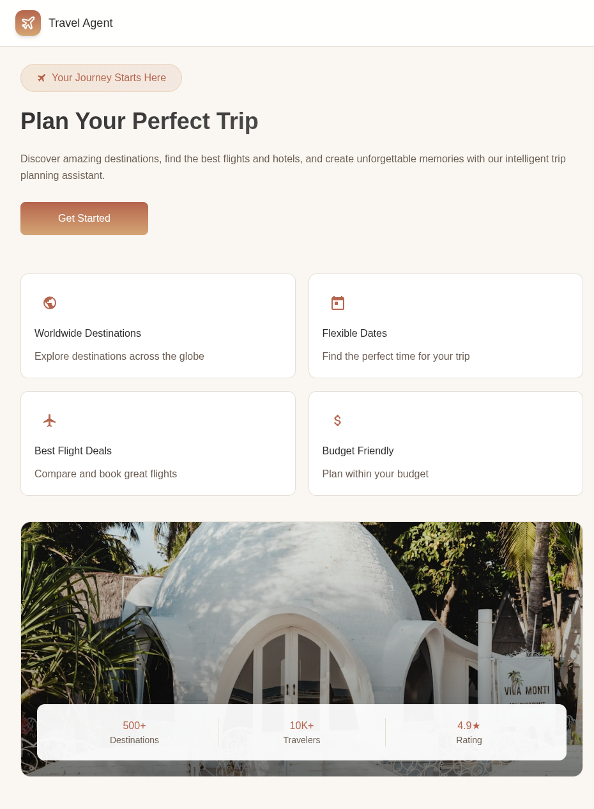
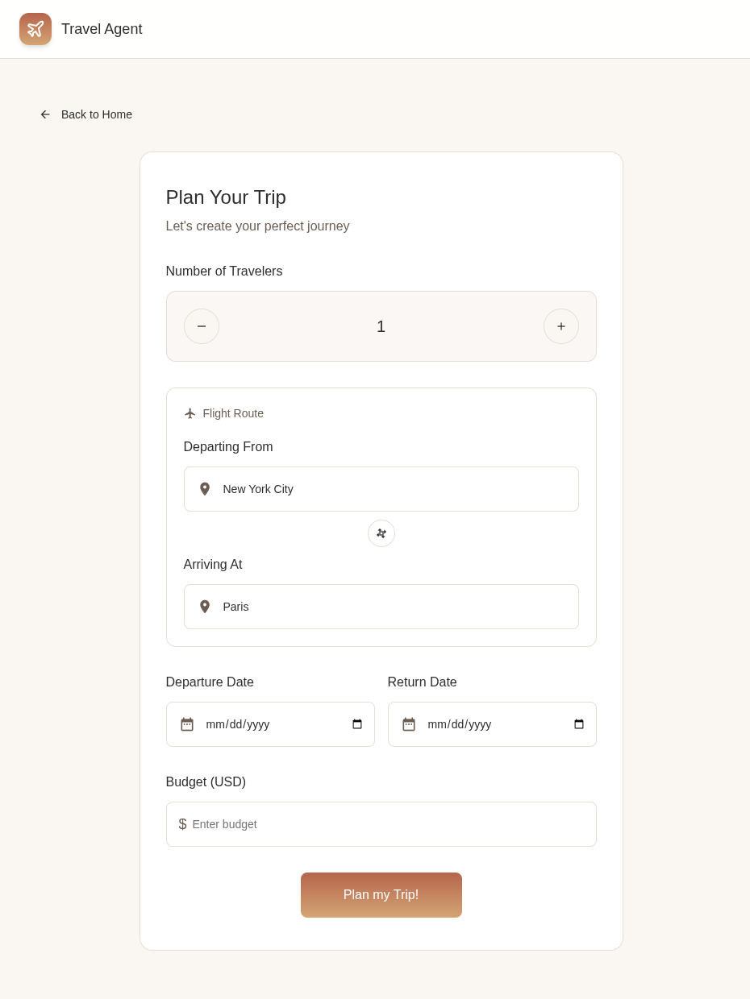
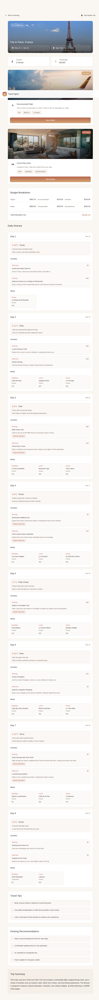

# Travel Agent

An intelligent travel planning application built with React 19 and Vite that helps users plan their perfect trip by combining real-time flight data, hotel information, and weather forecasts with AI-powered recommendations.

🌐 **[View Live Demo](https://travel-agent-azure.vercel.app/)**

## Features

- **Smart Trip Planning**: Interactive form with location autocomplete, traveler counter, and budget planning
- **Real-time Data**: Fetches live flight, hotel, and weather information from multiple APIs
- **AI-Powered Recommendations**: Uses OpenAI with Zod structured outputs to generate personalized trip plans
- **Progressive Loading**: Stage-by-stage content rendering with skeleton UI for improved perceived performance
- **Concurrent API Calls**: Parallel data fetching using Promise.all for optimal performance
- **Code Splitting**: Lazy-loaded routes with React.lazy for faster initial load
- **Session Storage**: Efficient data handling for large trip plans
- **Mobile-First Design**: Responsive CSS with mobile-first approach
- **Modern React**: Built with React 19 featuring hooks like useActionState

## Screenshots

### Home Page

*Landing page featuring the hero section with trip planning call-to-action and key features*

### Planning Page

*Interactive trip planning form with location inputs, date pickers, traveler counter, and budget input*

### Results Page

*Comprehensive trip itinerary with flight options, hotel recommendations, daily schedule, weather forecasts, and AI-generated travel tips*

## Tech Stack

- **React 19** - Latest React with Fast Refresh
- **Vite 7** - Lightning-fast build tool with HMR
- **React Router 7** - Client-side routing with lazy loading
- **OpenAI** - AI-powered trip plan generation with structured outputs
- **Zod** - Schema validation for API responses
- **ESLint** - Code quality and consistency

## Project Structure

```
travel-agent/
├── src/
│   ├── apis/                      # API integration modules
│   │   ├── flightApi.backend.js   # Amadeus flight search API
│   │   ├── hotelApi.backend.js    # Amadeus hotel search API
│   │   ├── tripPlanApi.backend.js # OpenAI trip planning integration
│   │   ├── streamingTripPlanApi.backend.js  # Streaming AI responses
│   │   ├── weatherApi.backend.js  # OpenWeather API integration
│   │   └── unsplashApi.backend.js # Unsplash image search
│   ├── components/                # Reusable components
│   │   ├── Header.jsx             # Navigation header
│   │   ├── HeroCarousel.jsx       # Home page carousel
│   │   ├── Icon.jsx               # SVG icon component
│   │   ├── LoadingProgress.jsx    # Stage progress indicator
│   │   ├── LoadingSkeleton.jsx    # Placeholder skeletons
│   │   ├── LocationAutocomplete.jsx  # City search autocomplete
│   │   ├── ErrorDisplay.jsx       # Error state component
│   │   ├── planning/              # Planning page components
│   │   │   ├── TravelerCounter.jsx    # Traveler increment/decrement
│   │   │   ├── DateSelectionSection.jsx  # Date inputs with validation
│   │   │   └── index.js           # Re-exports
│   │   └── results/               # Results page components
│   │       ├── BudgetBreakdown.jsx
│   │       ├── DailyItinerary.jsx
│   │       ├── FlightCard.jsx
│   │       ├── HotelCard.jsx
│   │       ├── PackingList.jsx
│   │       ├── ResultsSidebar.jsx
│   │       ├── TravelTips.jsx
│   │       ├── TripHeader.jsx
│   │       ├── TripInfoCards.jsx
│   │       ├── TripSummary.jsx
│   │       └── WeatherCard.jsx
│   ├── constants/                 # Application constants
│   │   ├── routes.js              # Route path constants
│   │   ├── api.js                 # API endpoint constants
│   │   ├── validation.js          # Form validation rules
│   │   └── index.js               # Re-export all constants
│   ├── data/                      # Static data
│   │   └── heroImages.js          # Home page carousel images
│   ├── hooks/                     # Custom React hooks
│   │   ├── useProgressiveTripData.js  # Progressive data loading
│   │   ├── usePersistedState.js   # State persistence to sessionStorage
│   │   ├── useTripPlanningForm.js # Form state management for Planning page
│   │   ├── useActiveSection.js    # Track active section for navigation
│   │   └── useSmoothScroll.js     # Smooth scroll behavior
│   ├── pages/                     # Route components (lazy loaded)
│   │   ├── Home.jsx               # Landing page
│   │   ├── Planning.jsx           # Trip planning form
│   │   └── Results.jsx            # Trip plan results
│   ├── utils/                     # Utility functions
│   │   ├── apiClient.js           # Standardized API request handling
│   │   ├── formatters.js          # Data formatting utilities
│   │   ├── logger.js              # Logging utilities
│   │   └── bookingLinks.js        # Generate booking URLs
│   ├── api.js                     # Main API orchestration
│   ├── config.js                  # API keys and configuration
│   ├── App.jsx                    # Root component with routing
│   └── main.jsx                   # Application entry point
├── public/                        # Static assets
├── docs/                          # Project documentation
├── eslint.config.js               # ESLint configuration
├── vite.config.js                 # Vite build configuration
└── package.json                   # Dependencies and scripts
```

## Getting Started

### Prerequisites

- Node.js (v16 or higher)
- npm or yarn
- API keys for:
  - Amadeus (flights and hotels)
  - OpenAI (trip planning)
  - OpenWeather (weather data)

### Installation

1. Clone the repository:
```bash
git clone <repository-url>
cd travel-agent
```

2. Install dependencies:
```bash
npm install
```

3. Create a `.env` file in the root directory with your API keys:
```env
VITE_AMADEUS_API_KEY=your_amadeus_api_key
VITE_AMADEUS_API_SECRET=your_amadeus_api_secret
VITE_OPENAI_API_KEY=your_openai_api_key
VITE_OPENWEATHER_API_KEY=your_openweather_api_key
```

4. Start the development server:
```bash
npm run dev
```

5. Open your browser to `http://localhost:5173`

## Development Commands

- `npm run dev` - Start Vite development server with HMR
- `npm run build` - Build for production
- `npm run lint` - Run ESLint on all files
- `npm run preview` - Preview production build locally

## Key Features Explained

### Progressive Loading

The application uses a progressive loading architecture that reduces perceived wait time from 15+ seconds to under 500ms:

- User navigates to Results page immediately after form submission
- Data loads in stages: weather → flights → hotels → AI plan
- Each stage displays content as it becomes available
- Skeleton UI provides visual feedback during loading

### Concurrent API Calls

The application uses `Promise.all` to fetch weather, flight, and hotel data simultaneously:

```javascript
const [weatherData, flightData, hotelData] = await Promise.all([
  fetchWeatherData(tripData),
  fetchFlightData(tripData),
  fetchHotelData(tripData)
]);
```

### Code Splitting

Routes are lazy-loaded to minimize initial bundle size in `src/App.jsx`:

```javascript
const Planning = lazy(() => import('./pages/Planning'));
const Results = lazy(() => import('./pages/Results'));
```

### Session Storage Optimization

Large trip plans are stored in sessionStorage instead of navigation state to improve performance and enable page refresh persistence.

## API Integration

### Amadeus API
- **Flights**: Real-time flight search with price and availability (`src/apis/flightApi.backend.js`)
- **Hotels**: Hotel search by location with pricing (`src/apis/hotelApi.backend.js`)
- **Authentication**: OAuth 2.0 token management with automatic refresh

### OpenAI API
- Generates personalized trip plans using structured outputs with Zod schemas (`src/apis/tripPlanApi.backend.js`)
- Provides recommendations for activities, dining, and local experiences

### OpenWeather API
- Fetches weather forecasts for destination cities (`src/apis/weatherApi.backend.js`)
- Provides temperature, conditions, and precipitation data

## Configuration

API configuration is centralized in `src/config.js`. For local development, use a `.env` file with the following variables:

```env
VITE_AMADEUS_API_KEY=
VITE_AMADEUS_API_SECRET=
VITE_OPENAI_API_KEY=
VITE_OPENWEATHER_API_KEY=
```

## Build Optimization

The project uses several optimization techniques:

- **Vite 7**: Modern build tool with native ES modules
- **Terser**: JavaScript minification for smaller bundle sizes
- **Image Optimization**: vite-imagetools for responsive images
- **Compression**: vite-plugin-compression for gzip/brotli compression
- **Tree Shaking**: Automatic removal of unused code
- **Code Splitting**: Automatic chunking for optimal loading
- **Lazy Loading**: React.lazy() for route-based code splitting

## Utilities

### API Client (`src/utils/apiClient.js`)
- Standardized POST and GET request handling
- Consistent error handling across all API modules
- Reduces code duplication in API files

### Formatters (`src/utils/formatters.js`)
- Date formatting
- Currency formatting
- Number formatting for display

### Logger (`src/utils/logger.js`)
- Centralized logging for development
- API operation logging

### Booking Links (`src/utils/bookingLinks.js`)
- Generate booking URLs for flights and hotels

## Browser Support

Modern browsers with ES2020+ support:
- Chrome 90+
- Firefox 88+
- Safari 14+
- Edge 90+

## Contributing

1. Work on feature branches (never commit to main)
2. Follow the mobile-first CSS approach
3. Use JavaScript (no TypeScript) and CSS (no Tailwind)
4. Run `npm run lint` before committing
5. Ensure all validations pass

## License

This project is private and not licensed for public use.

## Acknowledgments

- Amadeus for flight and hotel APIs
- OpenAI for AI-powered trip planning
- OpenWeather for weather data
- React team for React 19 features
